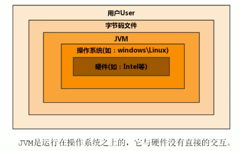
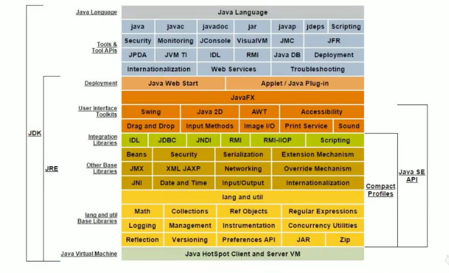
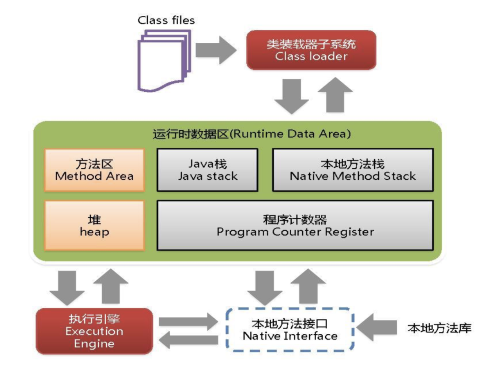
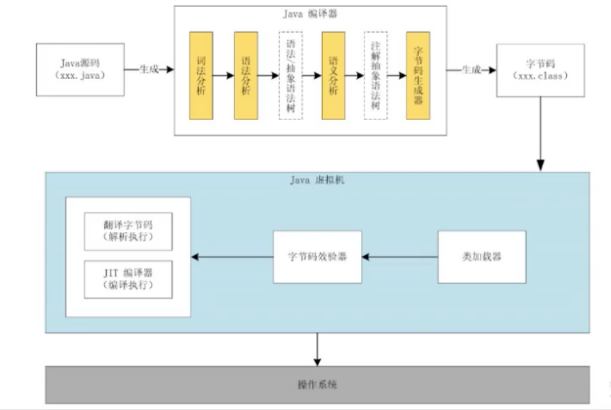

- [Java 虚拟机简介](#java-虚拟机简介)
  - [JVM的位置](#jvm的位置)
  - [JVM 的整体结构](#jvm-的整体结构)
  - [Java 代码执行流程](#java-代码执行流程)
- [JVM 架构模型](#jvm-架构模型)
- [JVM 声明周期](#jvm-声明周期)
  - [启动](#启动)
  - [执行](#执行)
  - [退出](#退出)
- [各类 JVM 的实现](#各类-jvm-的实现)
  - [SUN Classic VM](#sun-classic-vm)
  - [Exact VM](#exact-vm)
  - [HotSpot VM](#hotspot-vm)
  - [JRockit](#jrockit)
  - [IBM J9](#ibm-j9)
  - [KVM & CDC/CLDC Hotspot](#kvm--cdccldc-hotspot)
  - [Azul VM & BEA Liquid VM](#azul-vm--bea-liquid-vm)
  - [Apache Harmony](#apache-harmony)
  - [Microsoft JVM](#microsoft-jvm)
  - [TaobaoJVM](#taobaojvm)
  - [Dalvik VM](#dalvik-vm)
  - [Graal VM](#graal-vm)

## Java 虚拟机简介

* Java 虚拟机是一台执行 Java 字节码的虚拟计算机，它拥有独立的运算机制，器运行的Java字节码也未必是Java语言编译而成

* JVM 平台的各种语言可以共享Java虚拟机带来的跨平台性、优秀的垃圾回收器，以及可靠的及时编译器。
* Java 技术的核心就是Java虚拟机

**功能：**

> Java虚拟机就是二进制字节码的运行环境，负责装载字节码到其内部，解释/编译为对应平台上的机器指令执行

**特点：**

> 一次编译，到处运行
> 自动内存管理
> 自动垃圾回收机制

### JVM的位置

### JVM 的整体结构

以HotSpot为例，它采用解释器与及时编译器并存的架构

### Java 代码执行流程

java程序--（编译）-->字节码文件--（解释执行）-->操作系统（Win，Linux，Mac JVM）

## JVM 架构模型

Java 编译器输入端指令是基于**栈的指令集架构**

基于栈架构的特点

> * 设计和实现更简单，适用于资源受限的系统
> * 避开寄存器的地址分配：使用零地址指令的方式
> * 指令流中的指令大部分是零地址指令，执行过程依赖于操作栈，指令集更小，编译容易实现
> * 不需要硬件支持，可移植性好

另一种指令集架构是基于**寄存器的指令架构**,有以下特点

> * X86的二进制指令集：例如PC 和安卓虚拟机Davlik
> * 指令集架构完全依赖硬件，可移植性查
> * 性能优秀，执行效率高
> * 指令消耗少
> * 指令集以一地址指令、二地址指令和三地址指令为主

## JVM 声明周期

### 启动

通过引导类加载器（**bootstrap class loader**）创建一个初始类（**initial class**）来完成的，这个类是由虚拟机的具体实现指定的.

### 执行

* 一个运行中的java虚拟机有着一个清晰的任务：执行Java程序；
* 程序开始执行的时候他才运行，程序结束时他就停止；
* 执行一个所谓的Java程序的时候，真真正正在执行的是一个叫做Java虚拟机的进程。

### 退出

* 程序正常执行结束
* 程序异常或错误而异常终止
* 操作系统错误导致终止
* 某线程调用Runtime类或System类的exit方法，或Runtime类的halt方法，并且java安全管理器也允许这次exit或halt操作
* 除此之外，JNI规范描述了用JNI Invocation API来加载或卸载Java虚拟机时，Java虚拟机的退出情况

## 各类 JVM 的实现

### SUN Classic VM 

* 1996年Java1.0 发布时使用的虚拟机，jdk1.4 时被完全淘汰
* 现在hotspot 内置了此虚拟机
* 只提供了解释器
* 可以外挂JIT 编译器，单兼容性差

### Exact VM

* Exact Memory Management :准确式内存管理，虚拟机可以知道数据的类型
* 能实现编辑器与解释器混合工作模式

### HotSpot VM

* JDK 1.3 时HotSpot成为默认虚拟机
* SUN/Oracle JDK 和 Open JDK 用默认虚拟机
* 从服务器、桌面到嵌入式都有应用
* HotSpot 指的就是热点代码探测技术
    * 通过计数器找到最具编译价值的代码，处罚及时编译或栈上替换
    * 通过编译器和解释器的协同工作，在最优化的的程序响应和最佳执行性能中取得平衡

### JRockit

* 专注服服务器应用
  * 不关注程序启动，因此内部不包含解析器实现，全部代码都考及时编译器实现
* 世界上最快的JVM，低延时，提供毫秒级的响应
* MissionControl 套件，以一组极低消耗的来监控、管理和分析生产环境中的应用程序的工具
* 2008年 ，BEA被Oracle收购，在JDK1.8 中与HotSpot 初步整合，在HotSpot的基础上移植了JRockit的优秀特性

### IBM J9

* 应用于IBM的各种Java产品，市场定位于HotSpot接近
* 2017 年，IBM 发布开源了J9 VM ，命名为OpenJ9，由Eclipse 基金管理，也被成为 Eclipse OpenJ9

### KVM & CDC/CLDC Hotspot

* Oracke 在Java ME 产品线上的两款虚拟机为CDC/CLDC HotSpot Implementation VM
* KVM 是早期CLDC-HI 早期产品
* KVM 简单，轻量，高度可移植，面向更低端的设备上例如老人机，传感器等 

### Azul VM & BEA Liquid VM

* Azul VM 和BEA Liquid Vm 是与特定平台绑定、软硬件配合的专有虚拟机

### Apache Harmony

* 由IBM 和？Intel 联合开发的虚拟机，由Apache推出，与jdk1.5 和jdk1.6 兼容
* 因Sun的阻挠无法获取JCP，2011年退役
* Java 类库代码吸纳进了安卓SDK

### Microsoft JVM 

* 微软为了在IE3 中支持Java Applets 开发的
* 只能在window平台下运行
* 1997年，因侵权在window xp sp3 中移除

### TaobaoJVM

* 基于OpenJDK开发深度定制且开源的AlibabaJDK ,简称AJDK
* 依赖intel  的cpu 兼容性差但是性能高
* 已在天猫淘宝上线

### Dalvik VM

* 谷歌开发，基于Android，在2.2中提供了JIT
* 只能称作虚拟机 不能称为java虚拟机，他没有遵循Java虚拟机规范
* 基于寄存器架构，效率高，但是跟硬件耦合度比较高
* 不能直接执行class文件，执行的是dex文件
* 5.0使用支持提前编译的ART VM替换Dalvik VM

### Graal VM

* Oracle 2018年4月公开，口号 Run Programs Faster Anywhere.最可能替代HotSpot的产品
* 在HotSpot基础上增强而成的跨语言虚拟机，包括Java、Scala、Groovy、Kotlin、C、C++ 、JS、Ruby、Python 等
