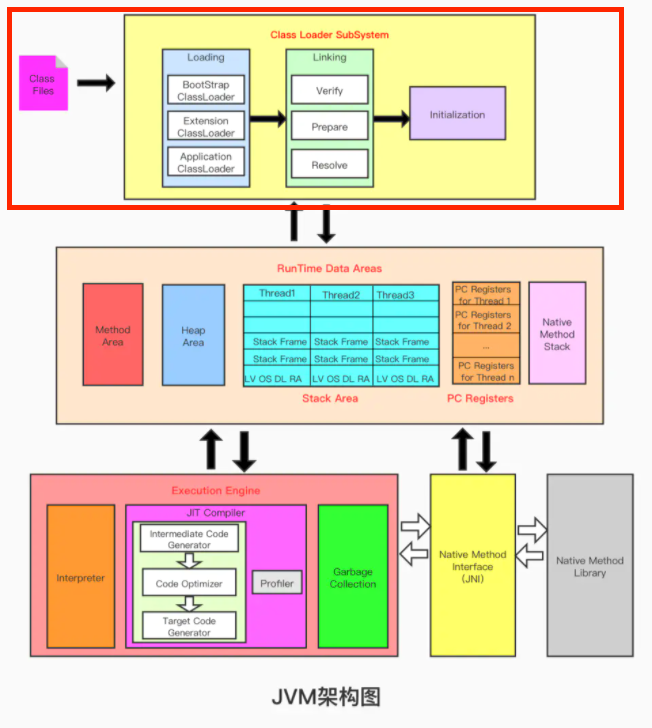
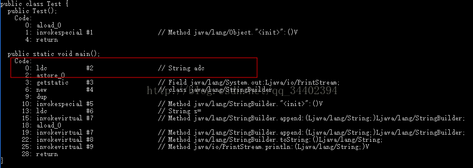
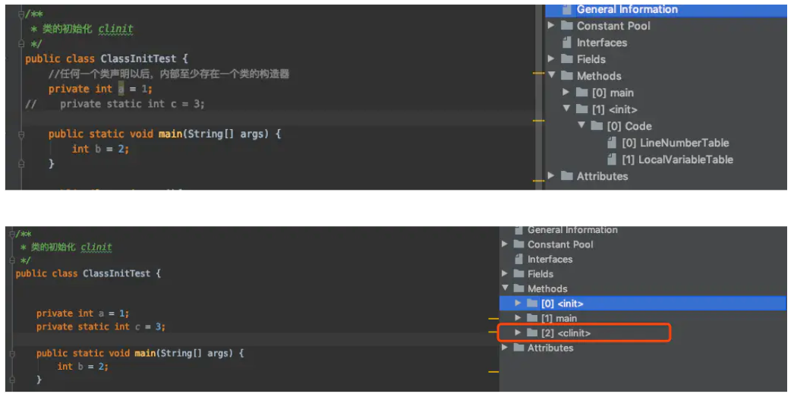
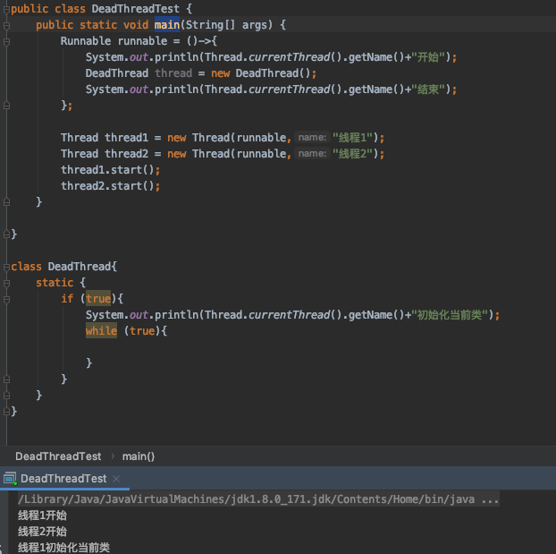

- [类加载子系统 概览](#类加载子系统-概览)
  - [类加载器的作用](#类加载器的作用)
  - [在JVM架构中的具体位置](#在jvm架构中的具体位置)
- [类加载的过程](#类加载的过程)
  - [类的生命周期](#类的生命周期)
    - [1. 加载](#1-加载)
    - [2. 连接.验证](#2-连接验证)
    - [3. 连接.准备](#3-连接准备)
    - [4. 连接.解析](#4-连接解析)
    - [5. 初始化](#5-初始化)
  - [类的卸载](#类的卸载)


## 类加载子系统 概览

### 类加载器的作用

* 类加载子系统负责从文件系统或者网络中加载Class文件，class文件在文件开头有特定的文件标识；
* ClassLoader只负责class文件的加载，至于它是否可以运行，则由Execution Engine决定
* 加载的类信息存放于一块成为方法区的内存空间。除了类信息之外，方法区还会存放运行时常量池信息，可能还包括字符串字面量和数字常量（这部分常量信息是Class文件中常量池部分的内存映射）

### 在JVM架构中的具体位置




## 类加载的过程

### 类的生命周期

一个类的完整的生命周期包含以下几个步骤

1. 加载(Loading)
2. 连接(Linking),连接的过程又包含以下3个步骤
   1. 验证(Verifty)
   2. 准备(Prepare)
   3. 解析(Resolve)
3. 初始化(Initialization)
4. 使用
5. 卸载

其中类加载器主要参与前三个步骤 **`加载->连接->初始化`**

#### 1. 加载

类的加载主要完成了以下三件事

1. 通过全类名获取定义此类的二进制字节流
2. 将字节流所代表的静态存储结构转换为方法区的运行时数据结构
3. 在内存中生成一个代表该类的 java.lang.Class 对象,作为方法区这些数据的访问入口

> 在虚拟机规范中，上面三步并不具体，例如第一条，规范中并没有指明具体从何处获取，如何获取，常见的我们可以从ZIP包(以及JAR、EAR、WAR)读取、其他文件(例如JSP)生成的方式等等

#### 2. 连接.验证

> 验证的`目的`：确保Class文件的字节流中包含信息符合当前虚拟机要求，保证被加载类的正确性，不会危害虚拟机自身安全。

验证主要包含了四种验证方式

1. 文件格式验证

   验证了字节流是否符合Class文件的格式规范，例如是否以 `0xCAFEBABE`开头，主版本号是否在当前虚拟机的处理范围之内、常量池中是否有不支持的类型

2. 源数据验证

   对字节码信息进行语义分析，保证描述信息符合Java的语言规范。例如该类是否有父类、这类类是否被继承了不允许被继承(final 类)的类

3. 字节码验证

    通过数据流和控制流的分析，确定语义是合法的、符合逻辑的，例如保证任意时刻操作数栈和指令代码的序列都能配合工作

4. 符号引用验证。

   确保解析动作能正确执行

#### 3. 连接.准备

> **准备阶段是正式为类变量分配内存并设置类变量初始值的阶段**，这些内存都将在方法区中分配。

准备阶段有以下几点需要注意：

* 为类变量分配内存并且设置该类变量的默认初始值，即零值； 类变量会分配在方法区中

  

* 不包含用final修饰的sttic，因为final在编译的时候就会分配了，准备阶段会显式初始化；

  > 比如给 value 变量加上了 fianl 关键字`public static final int value=111` ，那么准备阶段 value 的值就被赋值为 111。

* 这时候进行内存分配的仅包括类变量（static 变量），而不包括实例变量，实例变量会在对象实例化时随着对象一块分配在 Java 堆中。

#### 4. 连接.解析

* 解析阶段是虚拟机将常量池内的**符号引用**替换为**直接引用**的过程。

  * 符号引用：符号引用以一组符号来描述所引用的目标。
  * 直接引用：直接指向目标的指针、相对偏移量或一个间接定位到目标的句柄

  > 举例：在程序执行方法时，系统需要明确知道这个方法所在的位置。Java 虚拟机为每个类都准备了一张方法表来存放类中所有的方法。当需要调用一个类的方法的时候，只要知道这个方法在方发表中的偏移量就可以直接调用该方法了。通过解析操作符号引用就可以直接转变为目标方法在类中方法表的位置，从而使得方法可以被调用。
  
* 解析动作主要针对类或接口、字段、类方法、接口方法、方法类型、方法句柄和调用限定符7类符号引用进行。对应常量池中的CONSTANT_Class_info/CONSTANT_Fieldref_info、CONSTANT_Methodref_info等。


**说明**

> 在编译的时候一个每个java类都会被编译成一个class文件，但在编译的时候虚拟机并不知道所引用类的地址，就用符号引用来代替，而在这个解析阶段就是为了把这个符号引用转化成为真正的地址的阶段。
>
> 例如：
>
> ```java
> public class Test{
>  	public static void main() {
>    		String s=”adc”;
>    		System.out.println(“s=”+s);
>  	}
> }
> ```
>
> 在解析时对应的 s会被解析为符号引用
>
> 
>
>
> 而以下这段代码
>
> ```java
> public class Test{
>    	public static void main() {
>      	System.out.println(“s=”+”abc”);
>    	}
> }
> ```
>
> 会直接解析成直接引用。
>
> 
>

[符号引用与直接引用参考 ]: https://blog.csdn.net/qq_34402394/article/details/72793119 "走进java_符号引用与直接引用"

#### 5. 初始化

初始化阶段是执行类构造器 `<clinit> ()`方法的过程。

初始化阶段，虚拟机严格规范了有且只有以下几种情况下，必须对类进行初始化(只有主动去使用类才会初始化类)：

1. 当遇到 new 、 getstatic、putstatic或invokestatic 这4条直接码指令时，比如 new 一个类，读取一个静态字段(未被 final 修饰)、或调用一个类的静态方法时。
   * 当 jvm 执行 new 指令时会初始化类。即当程序创建一个类的实例对象。
   * 当 jvm 执行 getstatic 指令时会初始化类。即程序访问类的静态变量 (不是静态常量，常量会被加载到运行时常量池)。
   * 当 jvm 执行 putstatic 指令时会初始化类。即程序给类的静态变量赋值。
   * 当 jvm 执行 invokestatic 指令时会初始化类。即程序调用类的静态方法。
2. 使用 `java.lang.reflect` 包的方法对类进行反射调用时如Class.forname("..."),newInstance()等等。 如果类没初始化，需要触发其初始化。

3. 初始化一个类，如果其父类还未初始化，则先触发该父类的初始化。
4. 当虚拟机启动时，用户需要定义一个要执行的主类 (包含 main 方法的那个类)，虚拟机会先初始化这个类。
5. MethodHandle和VarHandle可以看作是轻量级的反射调用机制，而要想使用这2个调用， 就必须先使用findStaticVarHandle来初始化要调用的类。
6. 当一个接口中定义了 JDK8 新加入的默认方法（被 default 关键字修饰的接口方法）时，如果有这个接口的实现类发生了初始化，那该接口要在其之前被初始化。

**初始化阶段的注意要点**

* `<clinit> ()`方法不需要定义，是javac编译器自动收集类中的所有类变量的赋值动作和静态代码块中的语句合并而来。

> 类中的静态变量c 在字节码文件中就会生成一个clinit方法
>
> 

* 构造器方法中指令按语句在源文件中出现的顺序执行


* clinit()不同于类的构造器。（关联：构造器是虚拟机视角下的init()）
* 若该类具有父类，jvm会保证子类的clinit()执行前，父类的clinit()已经执行完毕


* 对于`<clinit>（）` 方法的调用，虚拟机会自己确保其在多线程环境中的安全性。因为 `<clinit>（）` 方法是带锁线程安全，所以在多线程环境下进行类初始化的话可能会引起死锁，并且这种死锁很难被发现。



### 类的卸载

卸载类即该类的 Class 对象被 GC。

卸载类需要满足 3 个要求:

1. 该类的所有的实例对象都已被 GC，也就是说堆不存在该类的实例对象。
2. 该类没有在其他任何地方被引用
3. 该类的类加载器的实例已被 GC

所以，在 JVM 生命周期类，由 jvm 自带的类加载器加载的类是不会被卸载的。但是由我们自定义的类加载器加载的类是可能被卸载的。
